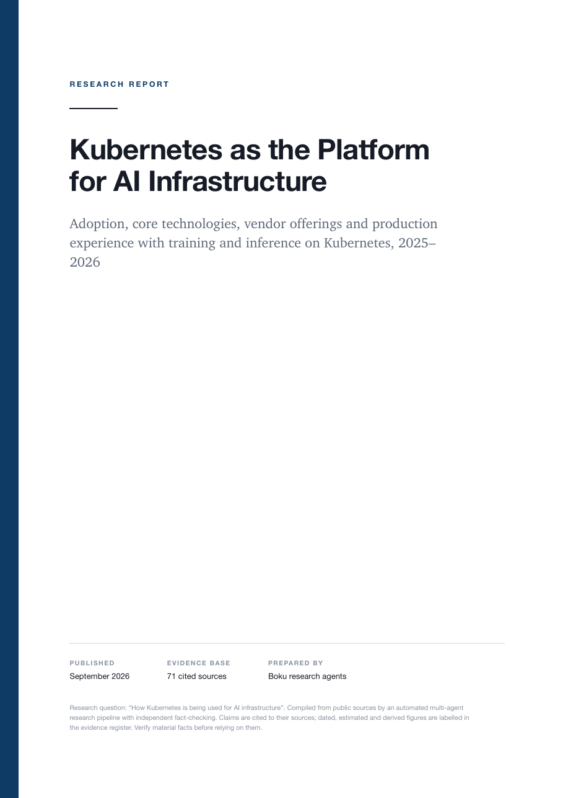
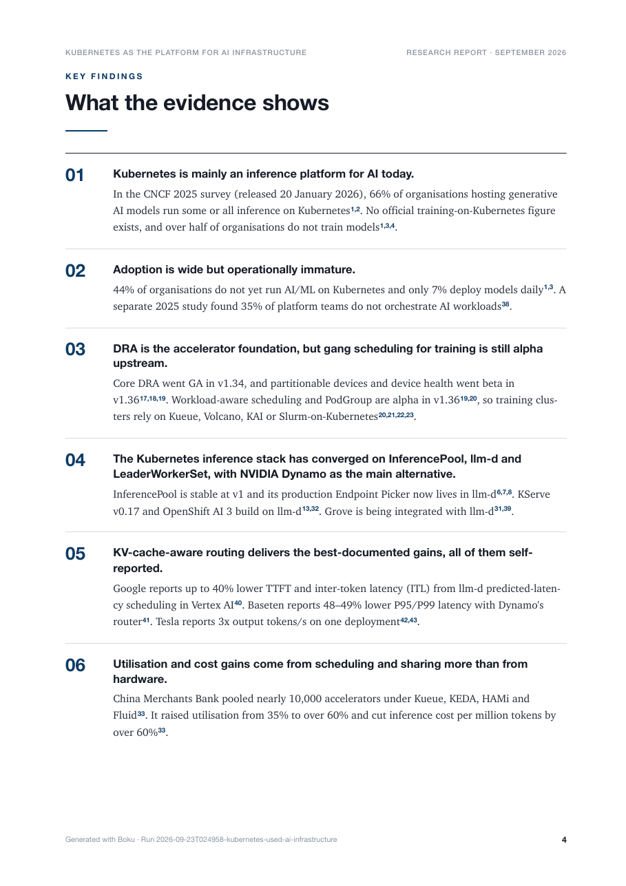
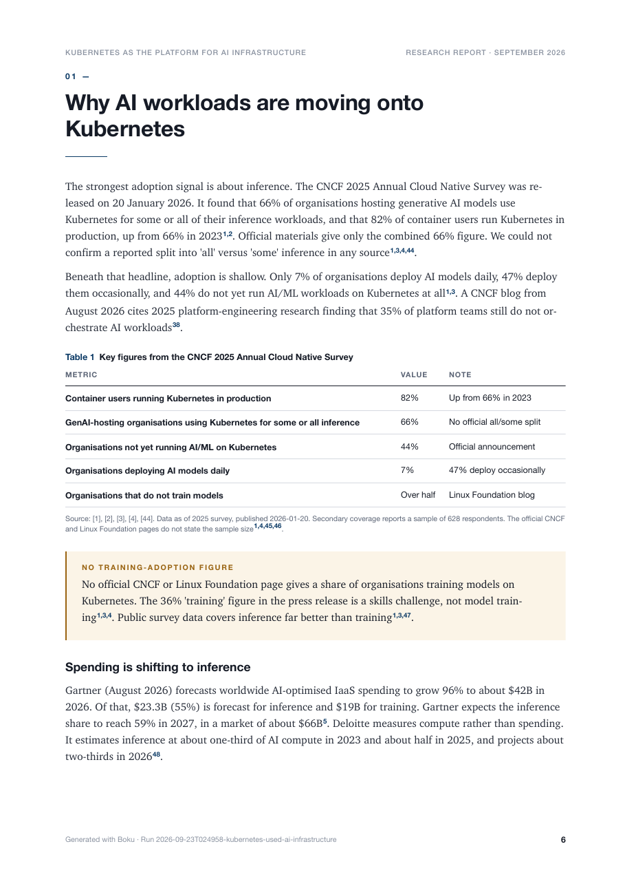
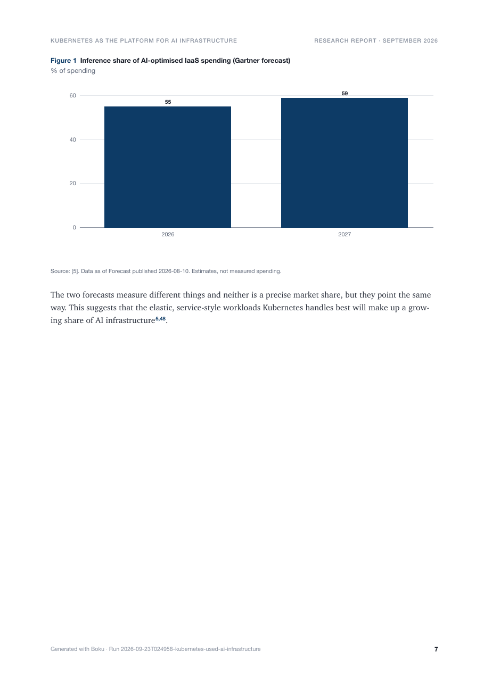

# Boku

**Give Boku a question. Boku researches it, checks the facts, writes the report and typesets the PDF.**

Boku is a small, open-source multi-agent research engine written in Go. It
plans a research programme, runs specialised [Claude Code](https://docs.claude.com/claude-code)
agents in parallel, keeps every claim linked to its sources, has an
independent critic check the evidence, synthesises and edits the findings, and
renders a professional research report as a PDF (plus HTML and Markdown).

```bash
boku report "How Kubernetes is being used for AI infrastructure"
```

```text
[1/7] Planning research
INFO  planner completed  title="Kubernetes as the Platform for AI Infrastructure"  workstreams=4
INFO    workstream  id=upstream-tech-stack  role=technical
INFO    workstream  id=adoption-standards  role=market
INFO    workstream  id=vendor-platforms  role=competitive
INFO    workstream  id=production-case-studies  role=case-study
[2/7] Researching
INFO  spawning 4 research agents  max_parallel=4
INFO  vendor-platforms research completed  role=competitive  took=2m17s
…
[3/7] Cross-checking evidence
INFO  fact checker round 1: needs_revision  verdicts=19  issues=8  critical=0
INFO  fact checker requested 2 follow-up research task(s)
INFO  fact checker round 2: pass  verdicts=19  issues=5  critical=0
INFO  research gate passed  warnings=1
INFO  fact-check gate passed  warnings=0
[4/7] Synthesizing findings
[5/7] Writing and editing report
[6/7] Running quality gates
INFO  editorial gate passed  warnings=0
[7/7] Rendering report
INFO  pdf gate passed  warnings=0
INFO  PDF rendered  pages=32  size="1060 KB"

✓ Report generated

Output:
  reports/kubernetes-platform-ai-infrastructure.pdf

Cost: $7.73
```

That is a real `--depth quick` run: 11 agent calls, 72 findings from 75
sources (56 tier 1), 2 claims rejected by the fact checker, about 20 minutes.

## Why Boku exists

Language models write fluent reports that are hard to trust: numbers without
sources, old data presented as current, estimates dressed up as facts. Boku
treats a report as the end of an **evidence pipeline**, not a prompt:

- **Evidence over prose.** Research agents return structured findings
  (claim, evidence, sources, date, kind). The editor can only cite findings
  that exist and survived fact-checking; citations are resolved by code.
- **Freshness is computed, not claimed.** Each finding carries the date it
  describes. Boku labels it *current* or *historical* against your freshness
  window, and keeps *estimated*, *derived* and *inference* separate from
  *reported* facts.
- **A critic with a veto.** An independent fact-checking agent reviews the
  corpus, rejects unsupported claims, and sends targeted follow-up research.
  Quality gates block publication when the evidence isn't there.
- **Deterministic rendering.** Agents supply content and data, never layout.
  Charts are drawn from numbers that must appear in the cited evidence;
  diagrams come from a node/edge description; typography is a print stylesheet.
- **Inspectable and resumable.** Every intermediate artifact lands in a run
  directory. Interrupted runs resume where they stopped.

## Architecture

```text
 topic ──▶ Planner ──▶ plan.json (objective, questions, workstreams)
              │
              ├──▶ Primary ─┐
              ├──▶ Market ──┤  parallel Claude Code agents,
              ├──▶ Technical┤  web search + fetch only
              └──▶ …       ─┘
                            ▼
                   Evidence store  (findings F001… ⇄ sources S001…,
                            │       de-duplicated, tiered, dated)
                            ▼
                   Fact checker ⟲ follow-up research   ── research & fact gates
                            ▼
                   Synthesis (thesis, insights, outline)
                            ▼
                   Editorial ⟲ revision                ── editorial gate
                            ▼
                   Report model (citations numbered, charts verified)
                            ▼
                   HTML ─▶ PDF (headless Chrome)       ── PDF gate
```

Agents are Claude Code processes (`claude -p`) run in restricted mode with
only web tools, a filtered environment and a JSON Schema for their output.
The Go process orchestrates; it never lets an agent write files or run
commands. See [docs/architecture.md](docs/architecture.md).

## Installation

Requirements:

- Go 1.25+
- [Claude Code](https://docs.claude.com/claude-code) installed and logged in
  (`claude` on your `PATH`)
- Google Chrome, Chromium, Edge or Brave for PDF output

```bash
go install github.com/riteshsonawane1372/boku/cmd/boku@latest
boku doctor
```

or from source:

```bash
git clone https://github.com/riteshsonawane1372/boku
cd boku
make build        # ./bin/boku
```

## Quick start

```bash
# Research and publish a PDF into ./reports
boku report "How enterprises are deploying AI agents in 2026"

# Deeper research, tighter freshness window, all formats, a spending cap
boku report "How financial institutions are deploying generative AI" \
  --depth deep --freshness 90d --format pdf,html,md --max-cost 25 --output ./reports

# Something failed or you hit Ctrl-C? Continue without redoing finished work
boku resume runs/2026-09-23T074500-enterprises-deploying-ai-agents-2026

# Inspect a run
boku status runs/2026-09-23T074500-enterprises-deploying-ai-agents-2026

# Re-render after editing a draft or the stylesheet (no agents, no cost)
boku render runs/2026-09-23T074500-enterprises-deploying-ai-agents-2026
```

Flags for `boku report`:

| Flag | Meaning |
| --- | --- |
| `--depth quick\|standard\|deep` | how much research to do |
| `--agents N` | maximum research workstreams the planner may create |
| `--parallel N` | maximum agents running at once |
| `--max-cost USD` | stop launching agents once spend reaches this |
| `--freshness 30d\|6m\|1y` | window within which information counts as current |
| `--sources "SEC filings, CNCF surveys"` | preferred sources or source types |
| `--format pdf,html,md` | outputs to publish |
| `--model opus` | model for all agents |
| `--iterations N` | fact-check → follow-up research rounds |
| `--min-sources N` | sources the research gate expects |
| `--output DIR`, `--runs DIR`, `--config FILE`, `--verbose` | |

Exit codes: `0` published, `1` error, `3` blocked by a quality gate, `130` interrupted.

## Example output

Pages from the report above, unedited. The full PDF is
[`docs/examples/kubernetes-ai-infrastructure.pdf`](docs/examples/kubernetes-ai-infrastructure.pdf)
(32 pages); pages 6–7 on their own are
[`docs/examples/kubernetes-ai-infrastructure-pages-6-7.pdf`](docs/examples/kubernetes-ai-infrastructure-pages-6-7.pdf).

| Cover | Key findings |
| :---: | :---: |
|  |  |
| **Page 6: section with table and callout** | **Page 7: chart built from evidence** |
|  |  |

### How pages 6–7 were generated

Nothing on these pages was laid out by a model. The path from web page to
print for **Figure 1** on page 7:

**1. A research agent records a finding** (`runs/<id>/evidence/findings.json`),
with its source, the period it describes, and its kind — here an *estimate*:

```json
{
  "id": "F052",
  "claim": "Gartner forecasts worldwide AI-optimised IaaS spending will grow 96% in 2026 to about $42B. Inference is forecast at $23.3B (55%), overtaking training at $19B, and inference's share is forecast to reach 59% in 2027 …",
  "source_ids": ["S060"],
  "as_of": "2026",
  "kind": "estimated",
  "temporal": "estimated"
}
```

**2. The fact checker reviews it** (`factcheck/round-1.json`,
`round-2.json`). Unsupported claims are rejected here and can never be cited.

**3. The editorial agent asks for a chart** in its structured draft
(`report/document.json`) — data and provenance only, no styling:

```json
{
  "type": "chart",
  "chart": {
    "kind": "column",
    "title": "Inference share of AI-optimised IaaS spending (Gartner forecast)",
    "units": "% of spending",
    "labels": ["2026", "2027"],
    "series": [{ "name": "Inference share", "values": [55, 59] }],
    "note": "Estimates, not measured spending."
  },
  "finding_ids": ["F052"],
  "as_of": "Forecast published 2026-08-10"
}
```

**4. Boku validates it.** `report.Build` checks that 55 and 59 actually
appear in F052 (a chart with any untraceable number is dropped), that it has
a title, units and a date, and resolves F052 → source S060 → reference **[5]**.

**5. Boku draws it.** `render.ChartSVG` produces the SVG deterministically;
the print stylesheet places caption, units and the source line
("Source: [5]. Data as of …"); headless Chrome prints the page with its
running header and page number. The PDF gate then checks page count, empty
pages, rendered sections and citations before the file is published.

Page 6 works the same way: every sentence ends in a finding reference such as
`[F001, F002]`, which becomes the superscript numbers; *Table 1* lists
`finding_ids` for its source line; the amber callout is a `callout` block with
`tone: "caution"`.

`testdata/sample/` holds a small **fictional** fixture that exercises every
block type. `make sample` renders it to `tmp/sample.pdf` without calling any agent.

## Demo: using Boku step by step

```bash
# 0. One-time: check Claude Code and Chrome are available
boku doctor
#   ✓ config       ok
#   ✓ claude code  2.1.280 (Claude Code)
#   ✓ chrome       /Applications/Google Chrome.app/Contents/MacOS/Google Chrome
#   ✓ prompts      ok

# 1. Research something. Quick depth and a cost cap are good for a first try.
boku report "How Kubernetes is being used for AI infrastructure" \
  --depth quick --max-cost 10 --format pdf,html,md

# 2. Open the result
open reports/kubernetes-platform-ai-infrastructure.pdf

# 3. See what happened: stages, every agent call, attempts, cost
boku status runs/2026-09-23T024958-kubernetes-used-ai-infrastructure

# 4. Read the evidence behind the report
less runs/2026-09-23T024958-kubernetes-used-ai-infrastructure/evidence/findings.md
cat  runs/2026-09-23T024958-kubernetes-used-ai-infrastructure/report/gates.json

# 5. Tweak the look (internal/render/style.css) or hand-edit the draft
#    (report/document.json), then re-render — no agents, no cost
boku render runs/2026-09-23T024958-kubernetes-used-ai-infrastructure

# 6. If a run is interrupted (Ctrl-C, crash, budget hit), continue it
boku resume runs/2026-09-23T024958-kubernetes-used-ai-infrastructure --max-cost 20
```

If a quality gate refuses the report (exit code 3), the reason is printed and
saved in `report/gates.json`; a blocked editorial draft is kept as
`report/draft.html` for inspection, but nothing is copied to `reports/`.

## What Boku uses

| Piece | Used for |
| --- | --- |
| **Go 1.25** (stdlib + `gopkg.in/yaml.v3`, `golang.org/x/sync/errgroup`) | the whole engine: CLI, orchestration, evidence store, gates, rendering |
| **Claude Code CLI** (`claude -p`) | the agent runtime; each agent is one restricted, non-interactive Claude Code process with web search/fetch |
| **JSON Schema** (`prompts/schemas/*.json`) | the contract for every agent's output, enforced by Claude Code's `--json-schema` |
| **Markdown prompts** (`prompts/*.md`) | agent instructions, embedded in the binary, overridable from disk |
| **HTML + CSS paged media** (`internal/render`) | the report layout: page size, running headers, page numbers, typography |
| **Inline SVG** generated in Go | charts and diagrams, drawn deterministically from data |
| **Headless Chrome / Chromium** over the DevTools pipe | printing HTML to PDF |
| **Files on disk** (`runs/<id>/`) | all state; no database, server or queue |

No vector database, no web framework, no Python.

## Tuning Boku

Most tuning is configuration; the rest is editing Markdown prompts or CSS.
Start with `boku init` to get a commented `boku.yaml`.

### Research depth, breadth and cost

| Goal | Setting |
| --- | --- |
| cheaper, faster first pass | `--depth quick --agents 3 --iterations 0` |
| more thorough | `--depth deep --agents 6 --iterations 2` |
| more agents at once | `--parallel 6` (`agents.max_parallel`) |
| hard spending cap | `--max-cost 25` (`agents.max_cost_usd`) |
| stricter "current" data | `--freshness 90d` (`research.freshness_days`) |
| point agents at sources | `--sources "SEC 10-K filings, CNCF surveys, vendor docs"` |
| demand a broader evidence base | `--min-sources 30` (`research.min_sources`) |
| slow agents / long research | `agents.timeout: 30m` |

Depth changes how many findings each researcher aims for (quick 6–10,
standard 10–18, deep 18–30) and the research gate's source target
(5 / 10 / 20).

### Models

```yaml
agents:
  model: sonnet              # default for every agent
  role_models:
    planner: sonnet
    fact-checker: opus       # a stronger critic catches more
    editorial: opus          # the best writer for the final report
```

A good cost/quality split is a fast model for researchers and the planner, and
the strongest model for the fact checker and editor.

### Prompts (what agents do and how they write)

```bash
cp -r prompts my-prompts          # copy the embedded prompts
$EDITOR my-prompts/editorial.md   # e.g. change the house style
```

```yaml
output:
  prompts_directory: ./my-prompts # files you don't copy fall back to built-ins
```

Useful places to tune:

- `common.md`: evidence rules shared by all agents (source tiers, dates, what counts as a finding)
- `planner.md`: which workstreams to create and when to use each role
- `<role>.md` (`market.md`, `financial.md`, …): what each researcher focuses on
- `fact-checker.md`: how aggressive the critic is
- `editorial.md`: voice, banned phrases, report structure, when to use charts and callouts

Each run's `manifest.json` records a hash of every prompt, so you can compare
runs made with different prompt versions.

### Look and feel

- `internal/render/style.css`: typography, colours (`--accent`), margins, table and callout styles
- `internal/render/report.html.tmpl`: page structure (cover, contents, section openers)
- `report.page_size: Letter`, `report.author: "Strategy Team"` in `boku.yaml`
- `report.charts: false` / `report.diagrams: false` to turn visuals off

Re-render an existing run with `boku render <run-dir>` after any of these
changes; no agents run and it costs nothing.

### Quality bar

Gate thresholds live in `internal/validation/quality.go` (minimum findings,
citation coverage, banned phrases, repetition). Raise them for stricter
reports; `research.max_iterations` controls how many fact-check → follow-up
rounds and editorial revisions Boku may spend reaching them.

## Agents

| Role | Job | Tools |
| --- | --- | --- |
| planner | turns the request into objective, questions and workstreams; chooses which research roles are needed | web search |
| primary | filings, regulators, official docs, standards, papers | web search, fetch |
| market | market structure, adoption, trends, statistics | web search, fetch |
| technical | architecture, infrastructure, engineering, security, operations | web search, fetch |
| financial | revenue, costs, margins, funding, unit economics | web search, fetch |
| competitive | competitors, positioning, pricing, differentiation | web search, fetch |
| case-study | concrete, named implementations and outcomes | web search, fetch |
| fact-checker | verifies claims, rejects unsupported ones, requests follow-ups | web search, fetch |
| synthesizer | selects, connects and interprets; designs the outline | none |
| editorial | writes the report as structured content with citations | none |

The planner only launches the roles a question needs. Prompts live in
[`prompts/`](prompts/) as Markdown and are embedded in the binary; point
`output.prompts_directory` at a copy to experiment without rebuilding. See
[docs/agents.md](docs/agents.md).

## Configuration

`boku init` writes a commented `boku.yaml`; Boku reads `./boku.yaml`
automatically or `--config path`. CLI flags override the file.

```yaml
agents:
  provider: claude-code
  model: ""                 # Claude Code default
  role_models: {editorial: opus}
  max_parallel: 4
  max_agents: 6
  max_retries: 2
  timeout: 20m
  max_cost_usd: 0           # 0 = unlimited

research:
  depth: standard
  freshness_days: 365
  max_iterations: 2

report:
  formats: [pdf]
  charts: true
  diagrams: true
  page_size: A4

output:
  directory: ./reports
  runs_directory: ./runs
```

Examples: [`examples/`](examples/).

## Run directory

```text
runs/2026-09-23T074500-kubernetes-used-ai-infrastructure/
  manifest.json        topic, config, prompt versions, stage status, tasks, cost
  prompt.md            the request
  plan.json, plan.md   research plan
  research/            one JSON artifact per research task (incl. follow-ups)
  evidence/            sources.json, findings.json, findings.md
  factcheck/           round-1.json, round-2.json, …
  synthesis/           synthesis.json, synthesis.md
  report/              document*.json (drafts), report.json, gates.json, report.html, report.md
  output/              the PDF that passed the gates
  agents/              raw agent responses
  logs/boku.log
```

## Security

Web content is untrusted input. Agents run with `--restricted` (no shell,
code execution or file-editing tools), no MCP servers, and an environment
stripped of everything but what Claude Code needs to authenticate. Agents
never write files; Boku writes their validated output. Rendered HTML escapes
all agent text. See [SECURITY.md](SECURITY.md).

## Development

```bash
make test      # unit tests; Claude Code is never required
make race      # with the race detector
make lint      # gofmt + go vet
```

Tests drive the whole pipeline with a scripted fake agent: failures, retries,
malformed output, cancellation, resume, budget limits, gate blocks and
rendering. See [docs/development.md](docs/development.md) and
[CONTRIBUTING.md](CONTRIBUTING.md).

## Roadmap

- Table of contents with page numbers (two-pass render)
- Per-section editorial passes for very long reports
- Source fetching and archiving by Boku itself (snapshot the pages cited)
- Additional agent providers behind `agent.Agent` (Anthropic API, OpenAI, local models)
- DOCX renderer
- Structured JSON logs

## License

[Apache-2.0](LICENSE)
